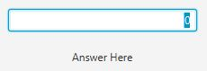
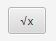

# Binary Calculator
## Team 9
Members
- Eli Sokeland
- Michael Keen
- Joshua Kennedy
- Duan Rollins
- Zachary Criswell

## Prerequisites 
Requirements
- [Install Java JDK 14](https://www.oracle.com/java/technologies/javase-jdk14-downloads.html)
- [Install Intellij](https://www.jetbrains.com/idea/)

# Starting the Application
1. Verify that you have Intellij Idea installed and updated.
2. Make sure your Intellij is using the above-listed JDK.  You can change this in the "Program Structure" menu if need be.
3. Clone the git link, and use it to "Create from Version Control" a new Java project, placing it whereever you like.
4. If this is not your first time running the application, make sure to click "Update" from the Git toolbar on the top right of Intellij (by default).
5. Wait for the Maven builder to finish importing all needed dependencies, and "allow" any requested imports or downloads.
6. Find the "App" class found at src/main/java/com/team9/App.java
7. Right click the class in the Project pane and select "Run 'App.main()"
8. You should be presented with a calculator that performs various functions, which are described in the next sections.

Tests can similarly be ran from the src/tests/java/com/team9 directory.

# Calculator Buttons and Function Descriptions

**The Read Out Display:**  This area shows the currently happening operations, as well as potential interim and final outputs.  It is important to note that this
calculator will only display integer outputs, rounded down.  Example:  Peforming the operation "101 / 10 ="would yield "2" in arabic numbers and 
"10" in binary because the system will not output decimal answers.

**Zero and One Buttons:**  These are the number buttons.  Pressing them will attempt to place the corresponding number into an operation, if valid.

**Plus Button:**  This button is used to perform the addition operation in conjunction with other valid inputs and interim outputs.

**Minus Button:**  This button is used to perform the subtraction operation in conjunction with other valid inputs and interim outputs.

**Multiply Button:**  This button is used to perform the multiplication operation in conjunction with other valid inputs and interim outputs.

**Divide Button:**  This button is used to perform the division operation in conjunction with other valid inputs and interim outputs.

**Squaring Button:**  This button is used to perform the squaring operation in conjunction with other valid inputs and interim outputs.

**Square Root Button:**  This button is used to perform the square root operation in conjunction with other valid inputs and interim outputs.

**Convert to Arabic Button:**  Pushing this button will convert the current readout to Arabic numeral format.

**Convert to Binary Button:**  Pushing this button will convert the current readout to binary number format.

**Clear Button:**  Pushing this button will clear the readout and all pending operations.

**Standard Window Function Buttons:**  These buttons are the typical window control buttons seen on most applications; the "-" minimizes the app, the square maximizes, and the "X" closes the GUI.

# Task Allocation
**Zachary Criswell:**  Handled linking of model-view-controller by providing methods within the controller class.

**Michael Keen:**  Handled method construction for division, multiplication, subtraction, and binary/decimal conversion.

**Joshua Kennedy:**  Initialized view (programmatic), handled gitFlow questions, and handled final README.md

**Duan Rollins:**  Handled linking of model-view-controller by providing methods within the controller class.

**Eli Sokeland:**  Translated view to FXML, initialized gitFlow setup, initialized gitHub repository, and configured initial MVC.

# Meeting Details
- Conversed frequently via Slack.
- Had one formal meeting 9/10/2020 @7:00 PM Eastern Standard Time.
  - All members were in attendance.
  - Discussed updated gitFlow requirements.
  - Assigned final tasking to complete the project in a timely fashion.
  - Discussed availability of all team members on the final day prior to submission.
  
